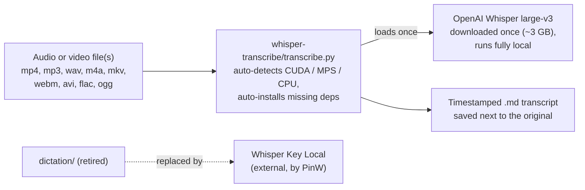

# Repo map: what every folder is for

The one-page orientation for this repository. If the structure changes, update this file and regenerate the visual map in the same pull request (`node docs/make-repo-map.mjs` rewrites `Tools-map.excalidraw` at the repo root; drawing rules live in `Repos/.claude/diagram-guidelines.md`).

Last verified: 2026-07-16.

## The one-sentence version

A small public toolbox with one live tool: `whisper-transcribe/` turns any audio or video file into a timestamped Markdown transcript, locally on your own GPU, and `dictation/` is the signpost left behind by a tool that was retired in favor of someone else's better project.

## Top-level folders

| Folder | What it is | Touch it when |
|---|---|---|
| `whisper-transcribe/` | The live tool: `transcribe.py` (a wrapper around OpenAI Whisper that auto-detects the GPU, installs missing dependencies, and batches whole folders) plus a from-zero [setup guide](../whisper-transcribe/README.md) written so a non-admin user on any OS can follow it. | Improving the script or the guide. |
| `dictation/` | A tombstone with directions. The custom live-dictation tool that lived here was retired; its [README](../dictation/README.md) points to [Whisper Key Local](https://github.com/PinW/whisper-key-local) (external, by PinW) and keeps the hard-won GPU setup note. The leftover `.gitignore` covers build artifacts of the deleted tool and is harmless. | Only if the Whisper Key recommendation changes. |
| `docs/` | This map, [MARKETING.md](MARKETING.md) (how Joaquim explains this repo), and the visual-map generator (`make-repo-map.mjs` + `render-map-preview.mjs`). | Documenting changes. |

Root files: [README.md](../README.md) (the front door: a table of tools with links) and `Tools-map.excalidraw` (the visual version of this page).

## How a transcript gets made

Two details worth remembering when explaining this:

1. Nothing leaves the machine. Whisper runs on the local GPU (or CPU), so private recordings never touch a cloud service; the only network use is the one-time model download.
2. The dictation folder is a deliberate example of retiring your own code: the custom tool was replaced by an external project that did the job better, and the folder now exists only to say so and to save the next person the GPU setup pain.
